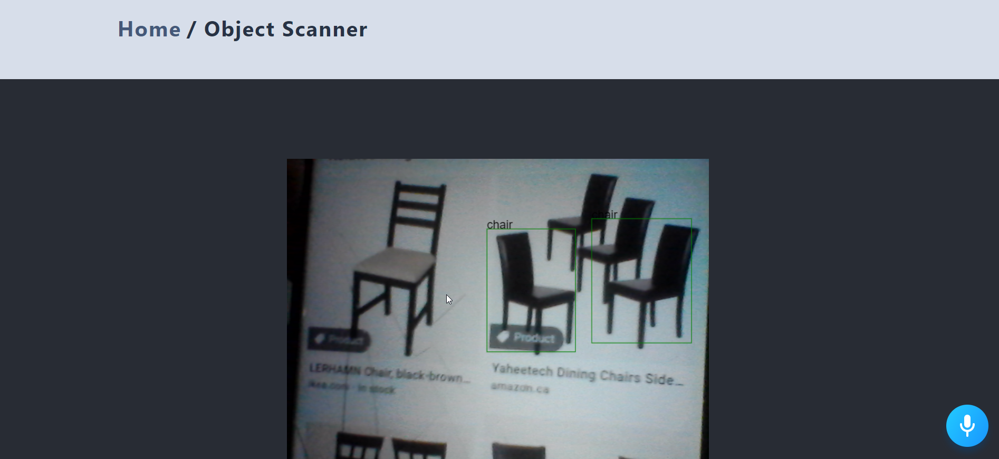
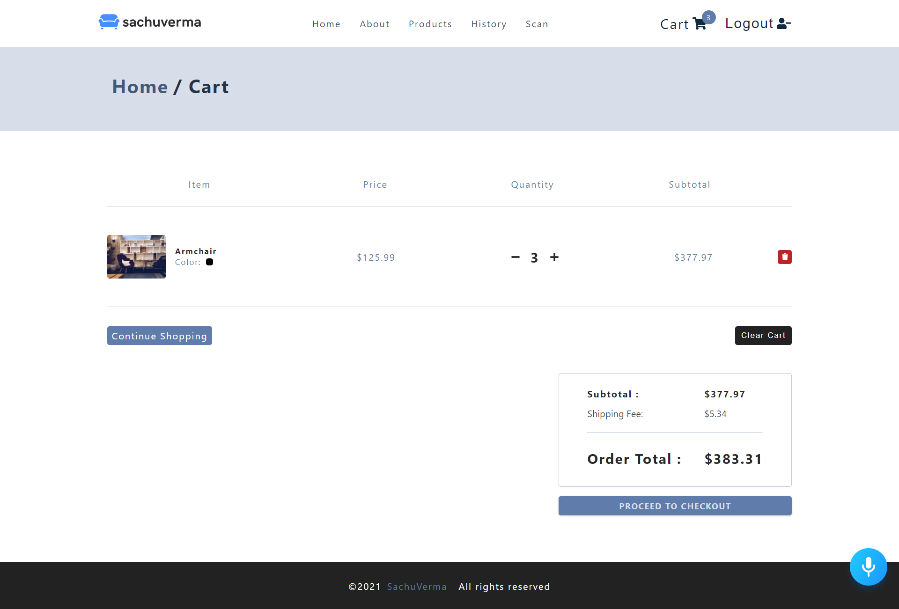
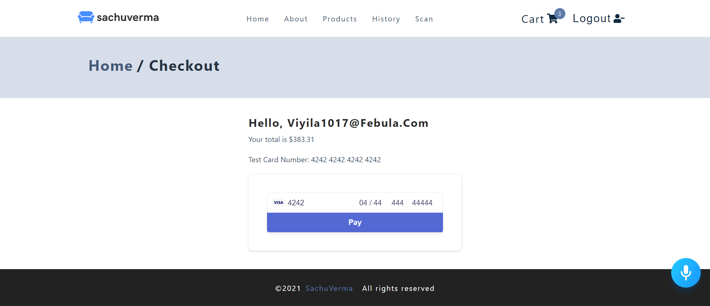
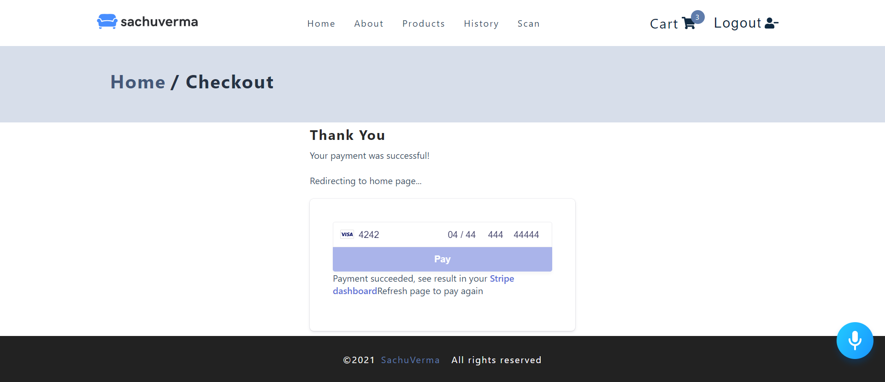

<!--
*** Thanks for checking out the Best-README-Template. If you have a suggestion
*** that would make this better, please fork the repo and create a pull request
*** or simply open an issue with the tag "enhancement".
*** Thanks again! Now go create something AMAZING! :D
-->


<!-- PROJECT SHIELDS -->
<!--
*** I'm using markdown "reference style" links for readability.
*** Reference links are enclosed in brackets [ ] instead of parentheses ( ).
*** See the bottom of this document for the declaration of the reference variables
*** for contributors-url, forks-url, etc. This is an optional, concise syntax you may use.
*** https://www.markdownguide.org/basic-syntax/#reference-style-links
-->


[![Contributors][contributors-shield]][contributors-url]
[![Forks][forks-shield]][forks-url]
[![Stargazers][stars-shield]][stars-url]
[![Issues][issues-shield]][issues-url]
[![MIT License][license-shield]][license-url]
[![LinkedIn][linkedin-shield]][linkedin-url]


<!-- PROJECT LOGO -->
<br />
<p align="center">
  <a href="https://github.com/sachuverma/React-E-Commerce-v2">
    
  </a>

  <h3 align="center">E Commerce Store</h3>

  <p align="center">
    An awesome e-commerce web app project using React.js and Tensorflow!
    <br />
    <a href="https://github.com/sachuverma/React-E-Commerce-v2"><strong>Explore the docs »</strong></a>
    <br />
    <br />
    <a href="https://github.com/sachuverma/React-E-Commerce-v2">View Demo</a>
    ·
    <a href="https://github.com/sachuverma/React-E-Commerce-v2/issues">Report Bug</a>
    ·
    <a href="https://github.com/sachuverma/React-E-Commerce-v2/issues">Request Feature</a>
  </p>
</p>


<br />

<!-- TABLE OF CONTENTS -->
<details open="open">
  <summary>Table of Contents</summary>
  <ol>
    <li>
      <a href="#about-the-project">About The Project</a>
      <ul>
        <li><a href="#built-with">Built With</a></li>
      </ul>
    </li>
    <li>
      <a href="#getting-started">Getting Started</a>
      <ul>
        <li><a href="#prerequisites">Prerequisites</a></li>
        <li><a href="#installation">Installation</a></li>
      </ul>
    </li>
    <li><a href="#usage">Usage</a></li>
    <li><a href="#roadmap">Roadmap</a></li>
    <li><a href="#contributing">Contributing</a></li>
    <li><a href="#license">License</a></li>
    <li><a href="#contact">Contact</a></li>
    <li><a href="#acknowledgements">Acknowledgements</a></li>
  </ol>
</details>

<br />
<br />


<!-- ABOUT THE PROJECT -->
# About The Project

## Screenshots

<h3 align="center">Home Page (light / dark theme)</h3>


<br />
<h3 align="center">Voice Navigation</h3>


<br />
<!-- <h3 align="center">Object Detection and Searching Similar Products</h3>

 -->


<!-- <br />
<h3 align="center">Cart and Payment Integration</h3>


 -->

<!-- 
<p align="center">
  
  
  
  
  
  
  
  
  
  
</p> -->


<br />


## Built With

Major frameworks, technologies, tools used:
* [node.js](https://getbootstrap.com)
* [react.js](https://jquery.com)
* [auth0](https://auth0.com)
* [firebase](https://firebase.google.com/)
* [tensorflow](https://www.tensorflow.org/js)
* [stripe](https://stripe.com/en-in)


<br />

<!-- GETTING STARTED -->
# Getting Started

This are steps on setting up your project locally.
To get a local copy up and running follow these simple example steps.
<br />
<br />

## Prerequisites

You need to have `node.js` installed in your local machine   
if not installed [visit node.js official website](https://nodejs.org/en/download/) and,  
download the Node.js source code or a pre-built installer for your platform

* update npm
  ```sh
  npm install npm@latest -g
  ```
* create accounts with 
  * [auth0](https://auth0.com)
  * [firebase](https://firebase.google.com/)
  * [stripe](https://stripe.com/en-in)
<br />

## Installation & Setup

1. Getting APIs (steps may differ later time) 
    - [auth0](https://manage.auth0.com/dashboard/us/github-users-auth/applications)
      - Applications
      - Create New Application
      - Settings
      - Client Id and Domain
  
    - [firebase](https://console.firebase.google.com/)
      - Add New Project
      - Project Overview
      - Project Settings > Firebase SDK Snippet
      - API Key
  
    - [stripe](https://dashboard.stripe.com/test/dashboard)
      - Create New Account 
      -  Overview 
      -  Get Your API keys > Test API Keys
      - Get Publishable and Secret Key 
   
2. Clone the repo ( git must be installed in your local machine )
   ```sh
   git clone https://github.com/sachuverma/React-E-Commerce-v2-v2
   ```
3. Install NPM packages
   ```sh
   npm install
   ```
4. Start Server
   ```sh
   npm start
   ```
5. Enter your API keys in `.env` file in root dir ( api id without '' )
   ```JS
    REACT_APP_AUTH_CLIENT_ID = 'ENTER_YOUR_API'
    REACT_APP_AUTH_DOMAIN = 'ENTER_YOUR_API'
    REACT_APP_FIREBASE_API = 'ENTER_YOUR_API'
    REACT_APP_STRIPE_PUBLIC_KEY = 'ENTER_YOUR_API'
    REACT_APP_AUTH_CLIENT_ID = 'ENTER_YOUR_API'
   ```
   
<br />


<!-- USAGE EXAMPLES -->
# Usage

Use this space to show useful examples of how a project can be used. Additional screenshots, code examples and demos work well in this space. You may also link to more resources.

_For more examples, please refer to the [Documentation](https://example.com)_
<br />


<!-- ROADMAP -->
# Roadmap

See the [open issues](https://github.com/sachuverma/React-E-Commerce-v2/issues) for a list of proposed features (and known issues).
<br />


<!-- CONTRIBUTING -->
# Contributing

Contributions are what make the open source community such an amazing place to be learn, inspire, and create. Any contributions you make are **greatly appreciated**.

1. Fork the Project
2. Create your Feature Branch (`git checkout -b feature/AmazingFeature`)
3. Commit your Changes (`git commit -m 'Add some AmazingFeature'`)
4. Push to the Branch (`git push origin feature/AmazingFeature`)
5. Open a Pull Request
<br />


<!-- LICENSE -->
# License

Distributed under the MIT License. See `LICENSE` for more information.
<br />


<!-- CONTACT -->
# Contact

Sachin Verma - [@sachuverma_](https://twitter.com/sachuverma_) - sachinverma53121@gmail.com

Project Link: [https://github.com/sachuverma/React-E-Commerce-v2-v2](https://github.com/sachuverma/React-E-Commerce-v2-v2)
<br />
 


<!-- ACKNOWLEDGEMENTS -->
# Acknowledgements
* [GitHub Emoji Cheat Sheet](https://www.webpagefx.com/tools/emoji-cheat-sheet)
* [Img Shields](https://shields.io)
* [Choose an Open Source License](https://choosealicense.com)
* [GitHub Pages](https://pages.github.com)
* [Animate.css](https://daneden.github.io/animate.css)
* [Loaders.css](https://connoratherton.com/loaders)
* [Slick Carousel](https://kenwheeler.github.io/slick)
* [Smooth Scroll](https://github.com/cferdinandi/smooth-scroll)
* [Sticky Kit](http://leafo.net/sticky-kit)
* [JVectorMap](http://jvectormap.com)
* [Font Awesome](https://fontawesome.com)


<!-- MARKDOWN LINKS & IMAGES -->
<!-- https://www.markdownguide.org/basic-syntax/#reference-style-links -->
[contributors-shield]: https://img.shields.io/github/contributors/sachuverma/React-E-Commerce-v2.svg?style=for-the-badge
[contributors-url]: https://github.com/sachuverma/React-E-Commerce-v2/graphs/contributors
[forks-shield]: https://img.shields.io/github/forks/sachuverma/React-E-Commerce-v2.svg?style=for-the-badge
[forks-url]: https://github.com/sachuverma/React-E-Commerce-v2/network/members
[stars-shield]: https://img.shields.io/github/stars/sachuverma/React-E-Commerce-v2.svg?style=for-the-badge
[stars-url]: https://github.com/sachuverma/React-E-Commerce-v2/stargazers
[issues-shield]: https://img.shields.io/github/issues/sachuverma/React-E-Commerce-v2.svg?style=for-the-badge
[issues-url]: https://github.com/sachuverma/React-E-Commerce-v2/issues
[license-shield]: https://img.shields.io/github/license/sachuverma/React-E-Commerce-v2.svg?style=for-the-badge
[license-url]: https://github.com/sachuverma/React-E-Commerce-v2/blob/master/LICENSE.txt
[linkedin-shield]: https://img.shields.io/badge/-LinkedIn-black.svg?style=for-the-badge&logo=linkedin&colorB=555
[linkedin-url]: https://linkedin.com/in/sachuverma
[product-screenshot]: src/images/user.png
[login-screenshot]: src/images/login.png
[auth-screenshot]: src/images/auth.png
